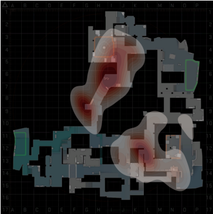

# Aluno
* `RA 232238`: `Breno Nunes Tavares`

# Análise do Artigo `Extracting and Composing a Dataset of Competitive Counter-Strike Global Offensive Matches`

| campo | valor |
|------------|----------------------------------------|
| referência | `Rocha, E., Maio, H., Menasché, D. S., & Miceli, C. (2021). Extracting and Composing a Dataset of Competitive Counter-Strike Global Offensive Matches. Dataset Showcase Workshop, SBBD 2021. https://sites.google.com/view/sbbd-dsw/artigos?authuser=0` |
| link       | `https://drive.google.com/file/d/106Ps__OM8ryapvP958FAIyhEWkzf_XfS/view` |
| dataset | `https://labnet.nce.ufrj.br/files/CSGO_Dataset/` |
| formato | `.parquet` |

## Resumo

O artigo escolhido consiste em uma explicação da extração e composição de um dataset que visa tornar possível uma análise mais aprofundada sobre o cenário competitivo do jogo Counter Strike Global Offensive.

Primeiramente, é fornecido o que motivou a escrita do artigo, além de uma breve explicação de como funciona uma partida do jogo. Em seguida, é apresentado brevemente o processo utilizado pelos autores para obter os dados que formam o dataset fornecido por eles. O workflow é composto basicamente por um webcrawler que percorre o site http://hltv.org visando coletar os dados “high-level”, como por exemplo informações da partida, resultado, jogadores e horário, para que em seguida ele obtenha o URL de download do arquivo com a “demo” da partida, que é basicamente um arquivo com a gravação da partida que pode ser aberto no jogo para análise. Utilizando esse link, um Downloader baixa esse arquivo para que um Parser consiga coletar os dados “low-level”, ou seja, os dados da demo de cada partida. Dentre esses dados, estão diversas informações dos jogos separados em tabelas formatadas em .parquet, tais como:

- bomb_lifecycle: informações relacionadas ao explosivo c4 plantado pelos terroristas para ganhar o round, com o tick e o round em que a ação foi realizada e o id jogador que realizou a ação;

- player_death: informações sobre todas as mortes que ocorreram no jogo, como o tick/round, quem morreu, quem matou, se foi tiro na cabeça, entre outros;

- tick: tabela que mostra informações sobre todos os jogadores a cada tick da partida, incluindo fatores como sua velocidade, coordenadas e vida;

- utility_lifecycle: arquivo contendo informações das granadas utilitárias lançadas durante a partida, tais como o tipo, o tick, round, jogador que lançou e coordenadas;

- weapon_fire: informações sobre todas as armas que atiraram no jogo, contendo o atirador, o round, tick e seu tipo.

Um exemplo da utilização das informações acima são mapas de calor das regiões onde as granadas são utilizadas em cada mapa, como é exemplificado com as "flashbangs" no mapa “Inferno”, na imagem a seguir:

O arquivo “manifest”, que contem as informações “high-level” mencionadas acima pode ser utilizado para uma análise mais superficial ou em conjunto com as informações “low-level”.

## Perguntas de pesquisa/análises

Algumas perguntas de pesquisa/análises que podem ser respondidas através da análise do dataset incluem:
- Qual é o comportamento de mobilidade do usuário?
- Quais são as estratégias de jogo mais adotadas?
- Quais são as melhores estratégias para vencer uma partida?
- Como identificar comportamento que resulta da utilização de cheats/scripts/programas externos não autorizados?

## Trabalhos relacionados

Algumas iniciativas relacionadas pelo artigo que são relacionadas com o mesmo são:
- Análises do jogo Second Life
  - Varvello, M. and Voelker, G. M. (2010). Second life: a social network of humans and
  bots.
  - Varvello, M., Picconi, F., Diot, C., and Biersack, E. (2008). Is there life in second life?
- Trabalhos semelhantes a esse artigo:
  - Xenopoulos, P., Doraiswamy, H., and Silva, C. (2020). Valuing player actions in counter-
  strike: Global offensive.
  - Bednarek, D., Zavoral, F., and Yaghob, J. (2017). Data preprocessing of esport game records - counter-strike: Global offensive.