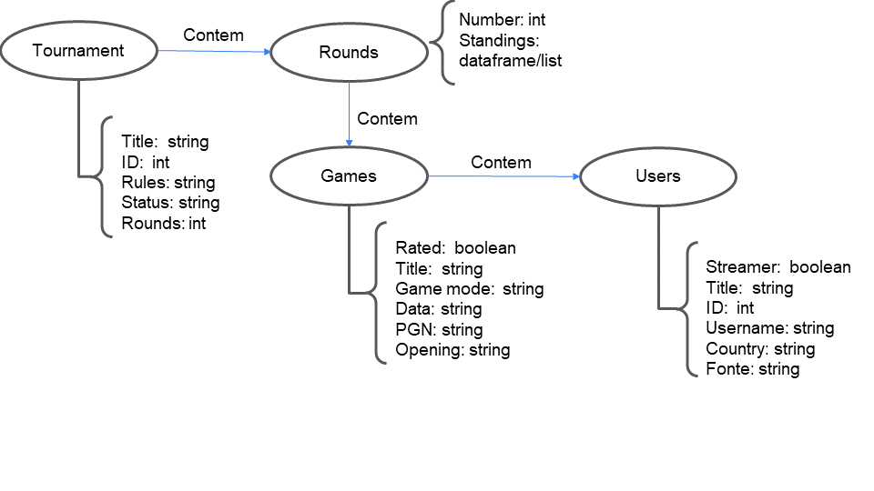

# Aluno
* `RA 232238`: `Breno Nunes Tavares`

## Modelo Lógico do Banco de Dados de Grafos
 
 _OBS: nesse diagrama é considerado um campeonato divido em rounds, ou seja, todos os jogadores acabam com o mesmo número de jogos e jogadores com pontuações semelhantes tendem a se enfrentar_

## Perguntas de Pesquisa/análise

> Liste aqui as três perguntas de pesquisa/análise
> * Pergunta 1 - Os jogadores que começam bem o campeonato tendem a terminar em posições melhores do que os que começam mal?
> * Pergunta 2 - Os jogadores possuem uma abertura definida para todos os jogos de um campeonato ou eles variam as aberturas?
> * Pergunta 3 - Qual a win-rate de jogadores que possuem título sobre aqueles que não possuem título?
